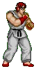
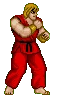
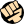

<!-- start description -->
<h1 align="center"> Street Fighter 1 </h3>
<p>
En aquest cas, farem una petita explicació sobre les bases del joc i com jugar-ho. 
</p>


<!-- end description -->

<!-- start prerequisites -->
## Prerequisits
1. Tenir el joc pels mitjans que siguin.
2. Teclat o mando.
3. Enjoy.

<!-- end prerequisites -->

<!-- Característiques -->

## Personatges Jugables

De base, aquest joc deixa al jugador o jugadors escollir entre 2 possibles personatges en individual:

| Nom | imatge | Descripció |
| ----------- | ----------- | ----------- |
| Ryu |  | Personatge principal de la saga, algunes de les seves habilitats més populars son: Hadouken, Shoryuken |
| Ken |  | Mateixes habilitats que el Ryu |

## Controls

Alguns controls principals son: 

- Hadoken:  + 

- Shoryuken:  + 

- Tatsumaki Senpukyaku:  + 

```
Les direccions de l'stick cambia segons la direcció a la que mira el personatge.
```


<!-- End característiques -->
