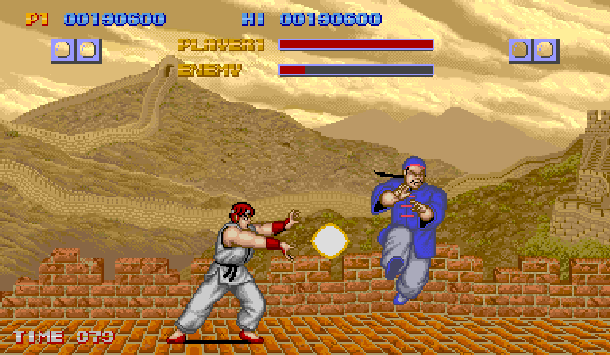

<!-- start description -->
<h1 align="center"> Street Fighter 1 </h3>

En aquest cas, farem una petita explicació sobre les bases del joc i com jugar-ho. 

<!-- end description -->

<!-- start prerequisites -->
## Prerequisits
- Tenir el joc pels mitjans que siguin.
- Teclat o mando.
- Enjoy.

<!-- end prerequisites -->

<!-- Característiques -->

## Personatges Jugables

De base, aquest joc deixa al jugador o jugadors escollir entre 2 possibles personatges en individual:

| Nom | imatge | Descripció |
| ----------- | ----------- | ----------- |
| Ryu |  | Personatge principal de la saga, algunes de les seves habilitats més populars son: Hadouken, Shoryuken |
| Ken |  | Mateixes habilitats que el Ryu |

<!-- End característiques -->
